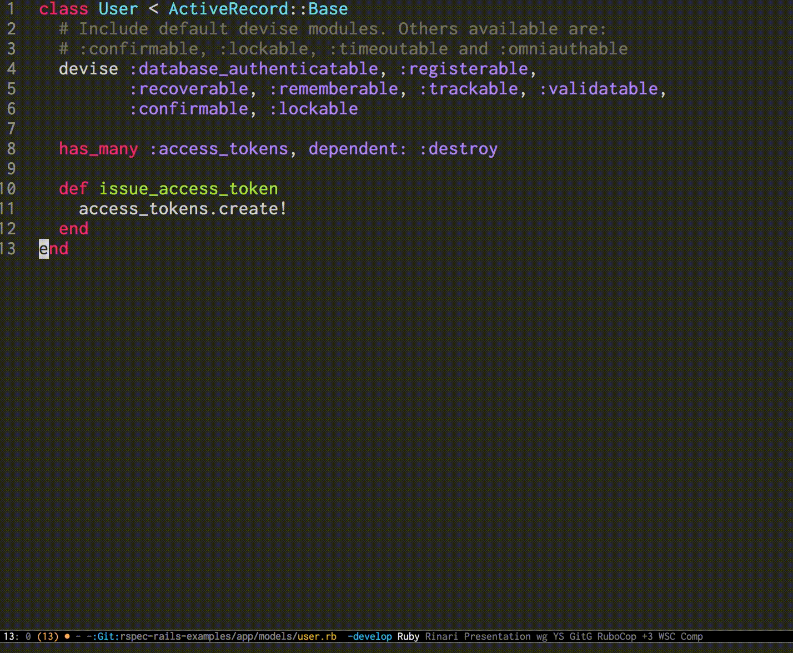

# Spec Jump

A simple package for jumping to the spec file, jumping back from the spec file.



## Setup

```el
;; write the code as bellow in your init.el
(add-to-list 'load-path "/path/to/spec-jump")
(require 'spec-jump)
```

And you need to install [counsel](https://github.com/abo-abo/swiper) before.

## Usage

Under the Git control project, you can just execute commands bellow in `*.rb` files.

### M-x spec-jump

+ If you have the correspond spec file, you can find and jump to the spec file.
+ If it is a spec file, you can find and jump to the original file.
